<!-- Limit image width and height -->
<style type="text/css">
img {     
  max-height: 500px;     
  max-width: 964px; 
}
</style>
 
<!-- Center image on slide -->
<script type="text/javascript" src="http://ajax.aspnetcdn.com/ajax/jQuery/jquery-1.7.min.js"></script>
<script type="text/javascript">
$(function() {     
  $("p:has(img)").addClass('centered'); 
});
</script>


## Introduction

1. Introduction to Adverse Selection, PIN, VPIN
2. Sequential Trade Model and Simulation of Data
3. Demonstration of HMM decoding of states with cluster analysis
4. Regressing VPIN against hidden states
5. Empirical study results

--- .class #id 

## The Lemon Problem


> 1. 'Passive' market makers providing liquidity to 'aggressive' informed traders 
> 2. Adverse Selection from Toxic Order Flow
> 3. Order flow is signed to determine direction of trading activity
> 4. Quote Rule, Lee-Ready Rule help infer toxicity...

--- &twocol w1:50% w2:50%
## Sequential Trading Model and Classic PIN
*** =left
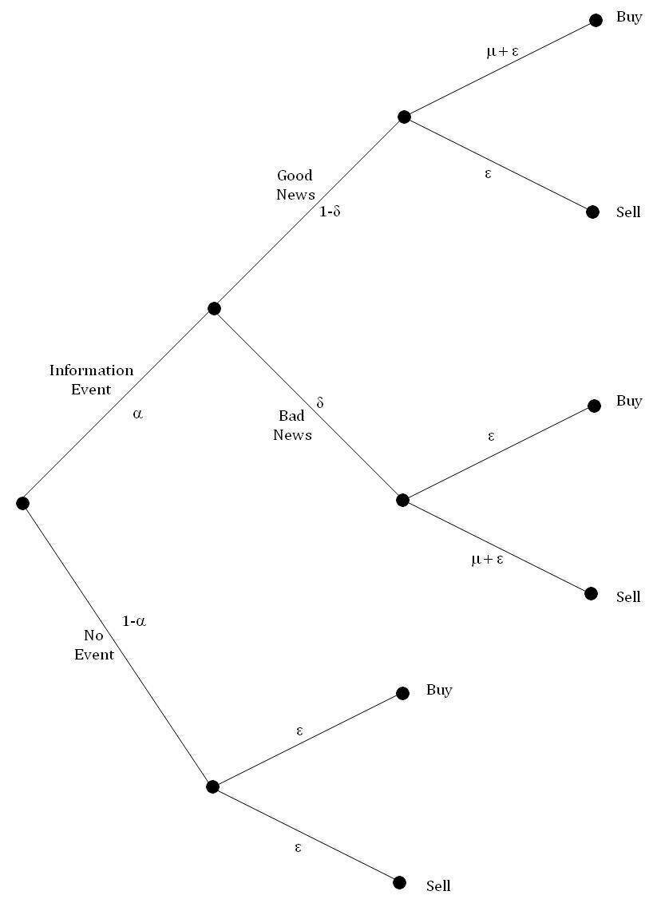
*** =right
>- $\alpha$: Probability of an 'Information Event'

>- $\delta$: Probability of it being bad news

>- $\mu$: Arrival rate of informed traders

>- $\epsilon$: Arrival rate of uninformed traders

>- Assume arrival rates follow Poisson mixture distributions, then parameters can be estimated via MLE hence enabling Probability of Information-based Trading (PIN) to be computed:
$$\text{PIN} = \frac{\alpha \mu}{\alpha \mu + 2 \epsilon}$$

(Easley & O’Hara - 1996)

---
## High Frequency PIN

> 1. Trades grouped into equal sized volume buckets $\tau = 1 \dots n$ each of size $V$

> 2. Perform bulk classification of buckets e.g. Z% classified as buy, and 1-Z% classified as sell:
$$V_{\tau}^B = \sum_{i = t(\tau - 1) + 1}^{t(\tau)} V_i Z \left(\frac{S_i - S_{i-1}}{\sigma_{\Delta S}}\right)$$
$$V_{\tau}^S = V - V_{\tau}^B$$

> 3. The total expected arrival rate is:
$$\underbrace{\alpha (1 - \delta) (\epsilon + \mu + \epsilon) }_\text{Volume from good news} + \underbrace{\alpha \delta (\mu + \epsilon + \epsilon) }_\text{Volume from bad news} + \underbrace{(1 - \alpha) (\epsilon + \epsilon) }_\text{Volume from no news} = \alpha \mu + 2 \epsilon$$

> 4. Volume Synchronised Probability of Information-based Trading (VPIN) can hence be derived:
$$VPIN = \frac{\alpha \mu}{\alpha \mu + 2 \epsilon} = \frac{\alpha \mu}{V}  \approx  \frac{\sum_{\tau = 1}^n |V_{\tau}^S - V_{\tau}^B|}{n V}$$
Volume-Synchronized Probability of Informddddde

--- 
## Flash Crash - May 6th 2010
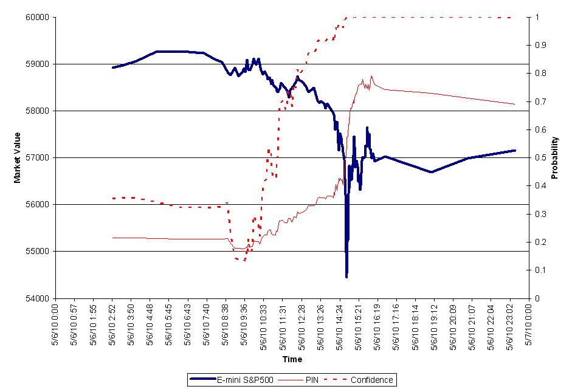

--- &twocol w1:50% w2:50%
## Simulation Study

$$\alpha =0.28, \delta = 0.33, \mu = 55, \epsilon=22.3$$

*** =left

*** =right

```r
while (j <= n) {
  if (runif(1) < alpha) {
    if (runif(1) < delta) {
      Vbuy[j] = rpois(1, epsilon)
      Vsell[j] = rpois(1, mu + epsilon) 
    } else {
      Vbuy[j] = rpois(1, mu + epsilon)
      Vsell[j] = rpois(1, epsilon)
    }
  } else {
    Vbuy[j] = rpois(1, epsilon)
    Vsell[j] = Vbuy[j]
  }
  j=j+1 
}
```

--- 
## Exploratory Data Analysis #1

$$\alpha =0.28, \delta = 0.33, \mu = 55, \epsilon=22.3$$

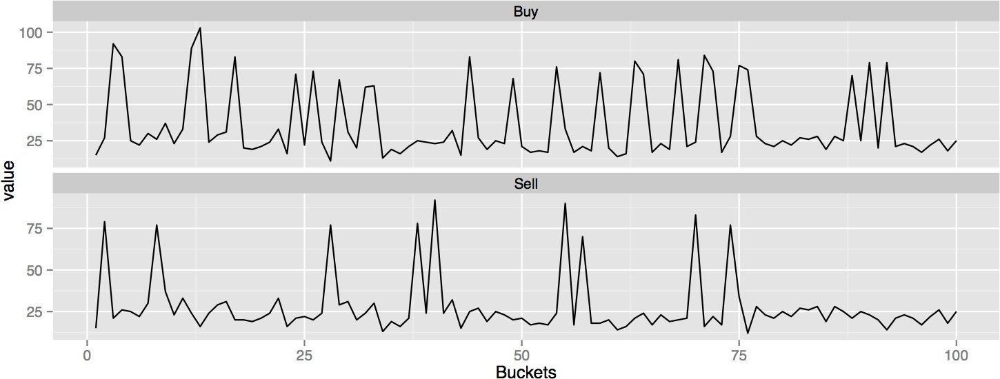

--- 
## Exploratory Data Analysis #2

$$\alpha =0.28, \delta = 0.33, \mu = 55, \epsilon=22.3$$

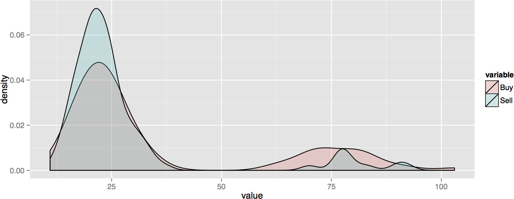

--- 
## Exploratory Data Analysis #3

$$\alpha =0.28, \delta = 0.33, \mu = 55, \epsilon=22.3$$

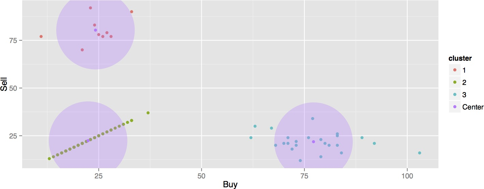

--- 
## Fitting a Bivariate Poisson Hidden Markov Model

Let $\{X_t \equiv (B_t, S_t): t = 1,2, \dots T \}$ and $\{C_t \equiv (C_{b;t}, C_{s;t}) : t = 1,2, \dots T\}$

> - Conditional probability of observing $b_t$ buy orders and $s_t$ sell orders
$$\begin{align}
 \begin{aligned}\label{eq:bivarPois}
 p_{i,j}(X) &= Pr(X_t = x | C_{b;t} = i, C_{s;t} = j) \\
            &= e^{- \lambda_{b;i}} \frac{(\lambda_{b;i})^{b_t}}{b_t !}  e^{- \lambda_{s;j}} \frac{(\lambda_{s;j})^{s_t}}{s_t !} \\ 
  \end{aligned}
\end{align}$$

> - In matrix form:
$$\mathbf{P}(x) = \begin{pmatrix}
                   p_1(b_t) p_1(s_t) &        & 0 \\
                                     & \ddots &   \\
                   0                 &        & p_m(b_t) p_n(s_t)
                  \end{pmatrix}$$

> - Unconditional hidden state distribution:
$$u_{i,j}(t) = Pr(C_{b;t} = i, C_{s;t} = j), t = 1,\dots,T$$

--- 
## Fitting a Bivariate Poisson Hidden Markov Model

Let $\{X_t \equiv (B_t, S_t): t = 1,2, \dots T \}$ and $\{C_t \equiv (C_{b;t}, C_{s;t}) : t = 1,2, \dots T\}$

> - Marginal distribution of $X$, $Pr(X_t = x)$:
$$\begin{align}
 \begin{aligned}\nonumber
                &= \sum_{i=1}^m \sum_{j=1}^n Pr(C_{b;t} = i, C_{s;t} = j) Pr(X_t = x | C_{b;t} = i, C_{s;t} = j) \\
                &= \sum_{i=1}^m \sum_{j=1}^n u_{i,j}(t) p_{i,j}(x) \\
                &= \begin{pmatrix}
                     u_{1,1}(t),\dots,u_{1,n}(t), \dots u_{m,1}(t), \dots u_{m,n}(t)
                   \end{pmatrix}
                   \begin{pmatrix}
                     p_1(b_t) p_1(s_t) &        & 0 \\
                                       & \ddots &   \\
                     0                 &        & p_m(b_t) p_n(s_t)
                   \end{pmatrix}
                   \begin{pmatrix}
                     1 \\
                     \vdots \\
                     1 
                   \end{pmatrix} \\
                &= \mathbf{u}(t) \mathbf{P}(x) \mathbf{1'}
 \end{aligned}
\end{align}$$


--- 
## Fitting a Bivariate Poisson Hidden Markov Model

Let $\{X_t \equiv (B_t, S_t): t = 1,2, \dots T \}$ and $\{C_t \equiv (C_{b;t}, C_{s;t}) : t = 1,2, \dots T\}$

> - Let 
$$\gamma_{i,j;k,l}(t) = Pr(C_{b;t+1} = k, C_{s;t+1} = l | C_{b;t} = i, C_{s;t} = j)$$

> - Transition probability matrix:
$$\boldsymbol{\Gamma}(1) = 
\begin{pmatrix}
  \gamma_{1,1;1,1}   \qquad \gamma_{1,1;1,2}   & \cdots & \gamma_{1,1;m,n-1}   \qquad \gamma_{1,1;m,n}\\
  \gamma_{1,2;1,1}   \qquad \gamma_{1,2;1,2}   &        & \gamma_{1,2;m,n-1}   \qquad \gamma_{1,2;m,n}\\
  \vdots                                       & \ddots & \vdots  \\
  \gamma_{m,n-1;1,1} \qquad \gamma_{m,n-1;1,2} &        & \gamma_{m,n-1;m,n-1} \qquad \gamma_{m,n-1;m,n}\\
  \gamma_{m,n;1,1}   \qquad \gamma_{m,n;1,2}   & \cdots & \gamma_{m,n;m,n-1}   \qquad \gamma_{m,n;m,n}
\end{pmatrix}$$

>- Hence the likelihood (where $\boldsymbol{\delta}$ is the stationary hidden state distribution, assuming it exists)
$$L_T = \boldsymbol{\delta} \mathbf{P}(x_1) \boldsymbol{\Gamma} \mathbf{P}(x_2) \dots   \boldsymbol{\Gamma} \mathbf{P}(x_T) \mathbf{1'}$$

--- 
## Decoding the Fitted Hidden Markov Model

> - Simulation parameters: $$\lambda_b = 
\begin{pmatrix}
  \epsilon_b \\
  \epsilon_b + \mu_b \\
  \epsilon_b
\end{pmatrix} = 
\begin{pmatrix}
  22.3 \\
  77.3 \\
  22.3
\end{pmatrix} \qquad
\lambda_s = 
\begin{pmatrix}
  \epsilon_s \\
  \epsilon_s \\
  \epsilon_s + \mu_s 
\end{pmatrix}= 
\begin{pmatrix}
  22.3 \\
  22.3 \\
  77.3
\end{pmatrix}$$

> - Fitted estimates: $$\hat{\lambda}_b = 
\begin{pmatrix}
  \epsilon_b \\
  \epsilon_b + \mu_b \\
  \epsilon_b
\end{pmatrix} = 
\begin{pmatrix}
  22.21 \\
  79.83 \\
  22.12
\end{pmatrix} \qquad
\hat{\lambda}_s = 
\begin{pmatrix}
  \epsilon_s \\
  \epsilon_s \\
  \epsilon_s + \mu_s 
\end{pmatrix}= 
\begin{pmatrix}
  21.95 \\
  21.95 \\
  73.38
\end{pmatrix}$$


--- 
## Decoding the Fitted Hidden Markov Model

> - Conditional distribution of the hidden states given the observations
$$\begin{align}
  \begin{aligned}\label{eq:localDecoding}
  Pr(C_t = i | \mathbf{X}^{(T)} = \mathbf{x}^{(T)}) &= \frac{Pr(\mathbf{X}^{(T)} = \mathbf{x}^{(T)}, C_t = i)}{Pr(\mathbf{X}^{(T)} = \mathbf{x}^{(T)}}\\
  &= \frac{\alpha_t(i) \beta_{t}(i)}{L_T}
  \end{aligned}
\end{align}$$

> - 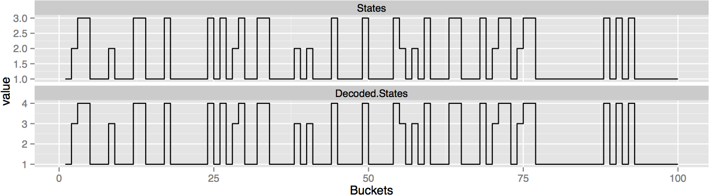

--- 
## Translating the Decoding States to Volume Bars

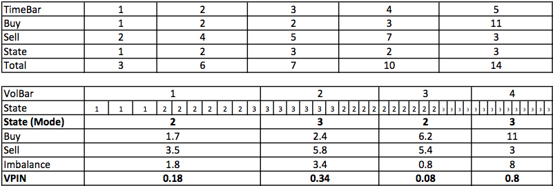

--- 
## Translating the Decoding States to Volume Bars

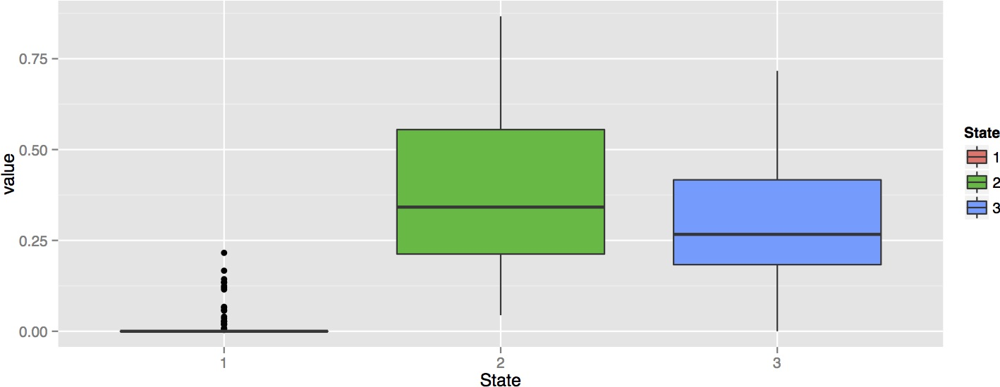

--- 
## Empirical Data Analysis

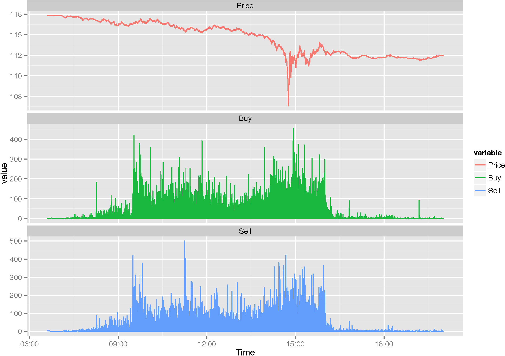


--- 
## Empirical Data Analysis

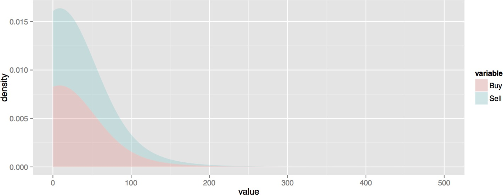


--- 
## Empirical Data Analysis

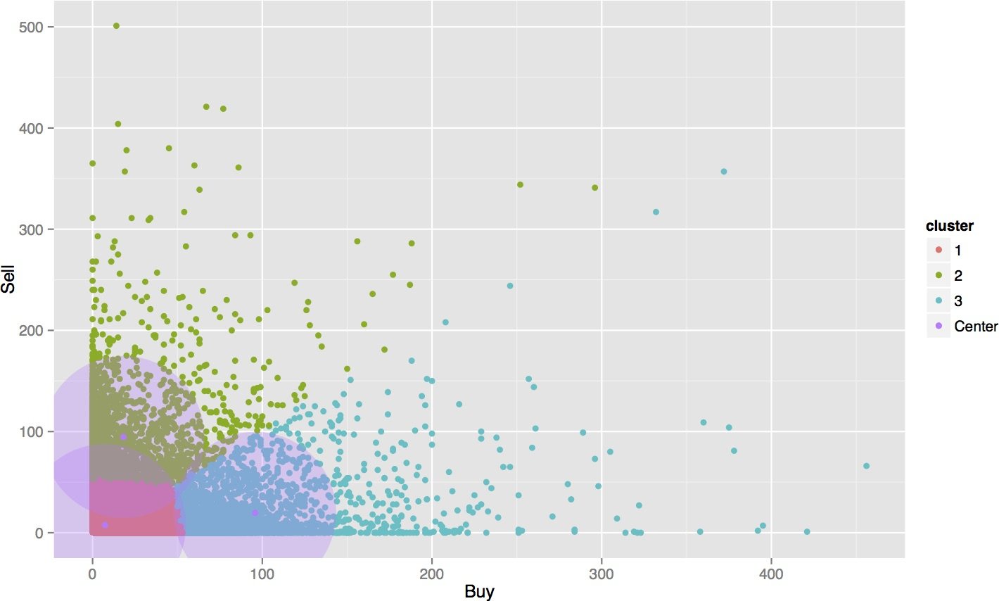


--- 
## Empirical Data Analysis

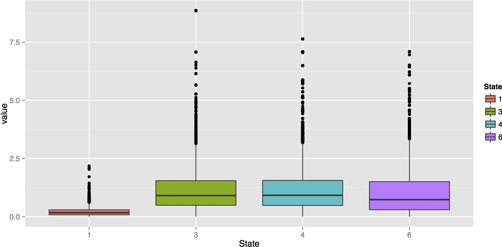

--- 
## Conclusions

> 1. Mismatch between theoretical model and empirical data

> 2. Possible issues with translation process from time to volume bars 

> 3. Data issues: E-Mini S&P 500 futures contracts vs SPY ETF

> 4. Numerical underflow with computational implementation

> 5. 

--- 
## Any Questions?
